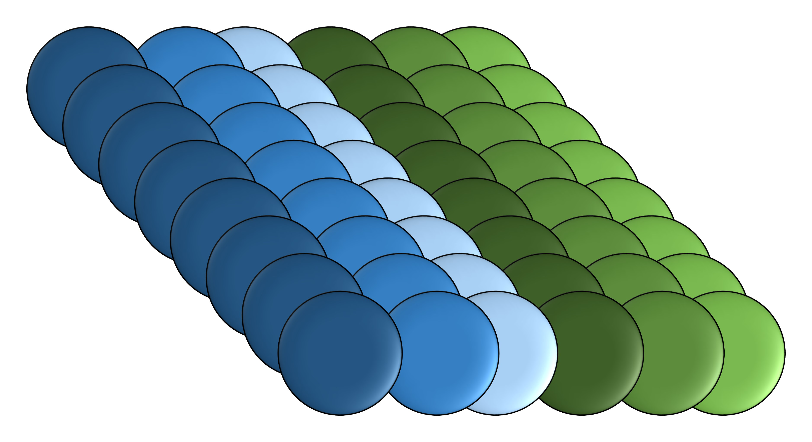

.. Documentation homepage.
   Copyright Ashley. 2023.

Simple theme
=============
Sphinx theme, with simple layout and minimal dependencies.

.. toctree::
   :maxdepth: 2
   :caption: Contents:

   installation
   options
   examples

Quick start
-----------
.. include:: quick_start.inc

For more detailed installation instruction see `installation page <installation>`_ and for theme ``conf.py`` configuration values see `options page <options>`_.

Style examples
--------------

Below are examples of the different layout options, with the default theme options. The `examples page <examples>`_ includes these examples with the example reStructuredText shown in the built HTML (the source reStructuredText for both this page and the examples page also include example reStructuredText for each text / layout style).

Text emphasis
~~~~~~~~~~~~~
A word in *emphasis*.

A pair of words in **strong emphasis**.

A word in `italics`.

Links
~~~~~
A hyperlink http://www.python.org.

Lists
~~~~~
A bullet point list (using ``*`` as the 'bullet'):

 * Item 1
 * Item 2
 * Item 3

A numbered list (using ``#.`` as the 'bullet'):

 #. Item 1
 #. Item 2
 #. Item 3

Tables
~~~~~~
Both simple tables and grid tables are rendered in the same way.

A simple table:

========  ========  ========
Header 1  Header 2  Header 3
========  ========  ========
Item      Item      Item
Item      Item      Item
Item      Item      Item
========  ========  ========

A grid table:

+----------+----------+----------+
| Header 1 | Header 2 | Header 3 |
+==========+==========+==========+
| Item     | Item     | Item     |
+----------+----------+----------+
| Item     | Item     | Item     |
+----------+----------+----------+
| Item     | Item     | Item     |
+----------+----------+----------+

Code
~~~~
In-line ``code``.

A code block, using the ``code-block`` directive, here a Python code snippet.

.. code-block:: python

   #!/usr/bin/env python3

   def print_hello_world(times_to_print):
       """ Prints "Hello World!" a given number of times.

       Args:
           times_to_print (int): Number of times a "Hello World!" is
               to be printed.
       """
       for _ in range(times_to_print):
           print("Hello world!")

Equations
~~~~~~~~~
This Simple theme has only been tested with ``imgmath``, which renders equations as images using `LaTex <https://www.latex-project.org/>`_ as the equation notation interpreter.

A block equation:

.. math::

   \Pi = 4 \sum_{n=0}^{\infty} \frac{(-1)^{n}}{2n+1}

An example of an in-line text math, such as adding a symbol like :math:`\pi`.

Subscript
~~~~~~~~~
Subscript value x\ :sub:`i`\ .

Superscript
~~~~~~~~~~~
Superscript value, for example three to the power-of two would be 3\ :sup:`2`\ .

Images
~~~~~~
An example image.

   A test image.

Admonitions
~~~~~~~~~~~

Danger:

.. danger::

   This is a danger admonition.

Error:

.. error::

   This is an error admonition.

Caution:

.. caution::

   This is a caution admonition.

Warning:

.. warning::

   This is a warning admonition.

Attention:

.. attention::

   This is an attention admonition.

Important:

.. important::

   This is an important admonition.

Note:

.. note::

   This is a note admonition.

Hint:

.. hint::

   This is a hint admonition.

Tip:

.. tip::

   This is a tip admonition.

A generic admonition:

.. admonition:: Custom admonition title

   This is a generic admonition.
