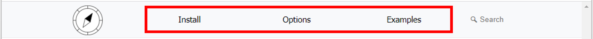

.. Options / settings guide.
   Copyright Ashley. 2023.

Options
=======
Navigation elements in the header can be set with the ``navigation_sections`` key of the ``html_theme_options`` variable in ``conf.py``.

``navigation_sections`` should be set to a dictionary. Keys in ``navigation_sections`` are the displayed text. Values in ``navigation_sections`` are either another dictionary for nested navigation menus or a string for the link reference.

A key of an empty string (``""``) is a special case, and sets the link destination for the parent key text.

For this documentation the ``html_navigation_sections`` variable is set to:

.. code-block:: python

   html_theme_options = {
       "navigation_sections": {
           "Install": {
               "": "installation.html",
               "Quick start": "installation.html#quick-start",
               "Full install": "installation.html#full-install"
           },
           "Options": "options.html",
           "Examples": "examples.html"
       }
   }
